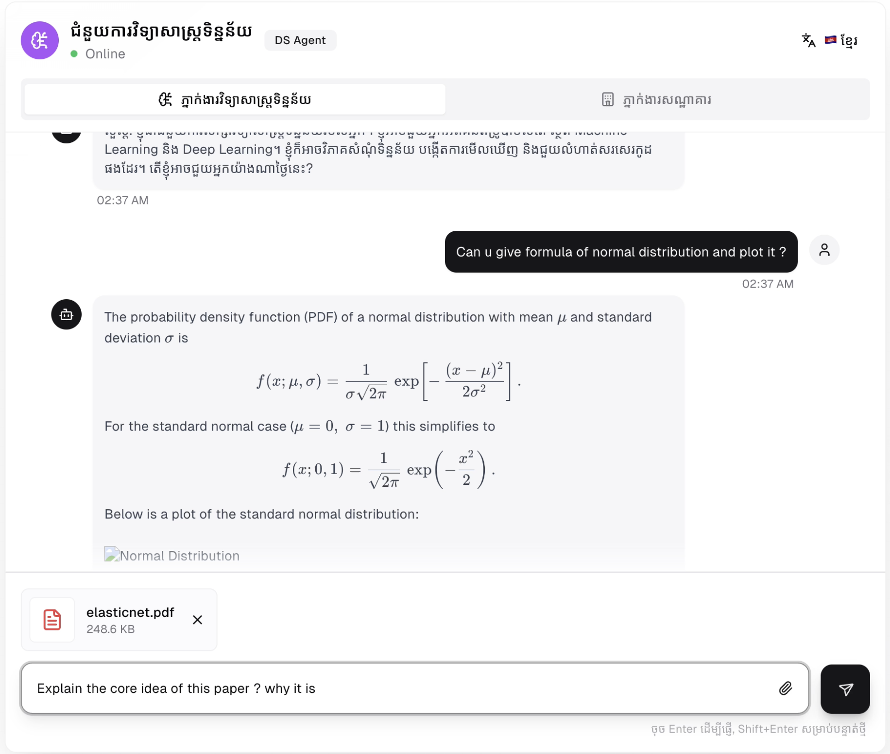
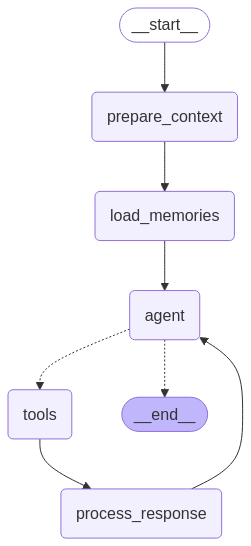

# Data Science Agent

<div align="center">

**AI-Powered Data Analysis & Machine Learning Assistant**

[](https://www.youtube.com/watch?v=uVgpjIIOgZ4)

*An intelligent agent that performs data analysis, statistical computing, machine learning, and data visualization through natural conversation*


</div>

---


## What It Does

Simply chat with the agent to:
- **Analyze datasets** - Upload CSV/Excel files and get comprehensive exploratory data analysis
- **Build ML models** - Train regression, classification, and clustering models with automatic evaluation
- **Create visualizations** - Generate publication-quality plots with matplotlib, seaborn, and plotly
- **Run statistical tests** - Hypothesis testing, correlation analysis, and distribution fitting
- **Execute Python code** - Full code execution with NumPy, Pandas, scikit-learn, and more
- **Process documents** - Extract insights from PDFs with RAG (Retrieval-Augmented Generation)
- **Analyze images** - Extract and solve math problems from images

**Example Interactions:**
```
You: "Analyze this dataset and show me correlations"
Agent: [Loads data, computes statistics, creates heatmap] "Strong correlation (r=0.85)
       between features X and Y. Here's the visualization..."

You: "Train a model to predict house prices"
Agent: [Trains Random Forest, evaluates model] "R² Score: 0.89. Top features:
       sqft (45%), location (30%)..."

You: "Plot the distribution of ages"
Agent: [Creates histogram with stats] "Mean: 32.5 years. Distribution is
       approximately normal with slight right skew..."
```

---

## Project Overview
This is a **Data Science Analysis Agent**. It's an AI-powered assistant that helps with data analysis, statistical computing, machine learning, and visualization tasks.

**Demo Video**: [Watch on YouTube](https://www.youtube.com/watch?v=uVgpjIIOgZ4)

---

## Architecture

### Multi-Service Microservices Architecture

```
┌─────────────────┐      ┌─────────────────┐      ┌─────────────────┐
│   Web Frontend  │─────▶│   LLM Service   │─────▶│   API Service   │
│   (Next.js)     │      │  (FastAPI/AI)   │      │  (FastAPI/DB)   │
│   Port 3000     │      │   Port 8005     │      │   Port 8000     │
└─────────────────┘      └─────────────────┘      └─────────────────┘
                                  │
                                  ▼
                         ┌─────────────────┐
                         │   PostgreSQL    │
                         │   Database      │
                         │   Port 5432     │
                         └─────────────────┘
```

**Services:**
1. **Web Frontend** (Next.js 15.2.4) - User interface for interacting with the agent
2. **LLM Service** (Python/FastAPI) - Core AI engine with LangGraph orchestration
3. **API Service** (FastAPI) - Database operations and business logic
4. **PostgreSQL Database** - Data persistence and conversation checkpointing

### Agent Workflow (LangGraph)

The LLM service uses LangGraph to orchestrate the agent's decision-making process:

<div align="center">



</div>

**Workflow Steps:**
1. **Start** - Receives user message and uploaded files
2. **Prepare Context** - Loads conversation history and file metadata
3. **Load Memories** - Retrieves relevant past conversations from PostgreSQL
4. **Agent** - Core reasoning node that decides which tools to use
5. **Tools** - Executes data analysis, code execution, visualization, RAG, etc.
6. **Process Response** - Formats results with markdown and LaTeX rendering
7. **End** - Returns final response to user

The agent loops between reasoning and tool execution until the task is complete, with full conversation state checkpointed to PostgreSQL for context retention.

---

## Core Agent Capabilities

### 1. **Data Analysis & Exploratory Data Analysis (EDA)**
The agent can perform comprehensive data analysis including:
- Loading and exploring datasets (CSV, Excel)
- Descriptive statistics (mean, median, std, quartiles)
- Correlation analysis with heatmaps
- Distribution analysis (histograms, normality tests)
- Outlier detection (box plots, IQR method)
- Missing value analysis
- Feature relationships visualization

### 2. **Statistical Analysis**
- Hypothesis testing (t-tests, chi-squared tests)
- Correlation analysis (Pearson, Spearman)
- Distribution fitting and testing
- Probability calculations
- Statistical inference
- A/B testing analysis

### 3. **Machine Learning**
The agent supports full ML workflows:
- Data preprocessing and feature engineering
- Model training (regression, classification, clustering)
- Cross-validation and hyperparameter tuning
- Model evaluation with proper metrics
- Feature importance analysis
- Model persistence with metadata

**Supported Algorithms:**
- Linear/Logistic Regression
- Random Forests
- XGBoost, LightGBM
- Support Vector Machines
- K-Means Clustering
- Neural Networks (TensorFlow/PyTorch)

### 4. **Data Visualization**
Comprehensive plotting capabilities:
- Histograms and distribution plots
- Scatter plots and correlation matrices
- Box plots for outlier detection
- Heatmaps for correlation analysis
- Time series plots
- Custom matplotlib/seaborn visualizations
- Interactive Plotly charts

### 5. **Code Execution & Generation**
- **Full Python code execution** with scientific computing libraries
- **Pre-imported libraries**: NumPy, Pandas, Matplotlib, Seaborn, SciPy, scikit-learn, Plotly, SymPy
- Code generation using specialized coding model (Qwen3-coder:30b)
- Real-time error handling and automatic code fixing
- Support for custom figure sizes and high-resolution exports

### 6. **Document Processing & RAG**
- PDF document processing and storage in vector database
- Semantic search across uploaded documents
- Text extraction from PDFs
- Context-aware question answering from documents

### 7. **Image Analysis (Vision)**
- Analyze images containing math problems
- Extract mathematical equations from images
- Analyze charts and graphs in images
- Solve problems from uploaded exercise images

---

## Example Use Cases

### Use Case 1: Dataset Analysis
```
User: "I uploaded grades.csv, analyze it"

Agent Actions:
1. Loads CSV → Shows 100 rows, 3 columns (student_id, math, science)
2. Computes correlation → r=0.85 between math and science
3. Creates correlation heatmap
4. Generates distribution plots
5. Detects outliers

Response: "I analyzed your grades dataset with 100 students:
- Strong positive correlation (r=0.85) between math and science scores
- This suggests students who perform well in math tend to excel in science
- 3 outliers detected in the lower range
[displays visualizations]"
```

### Use Case 2: Machine Learning
```
User: "Train a model to predict house prices"

Agent Actions:
1. Loads houses.csv
2. Performs EDA → distribution analysis
3. Trains Random Forest regression
4. Evaluates with cross-validation
5. Shows feature importance

Response: "I trained a Random Forest model:
- R² Score: 0.89 (explains 89% of variance)
- RMSE: $45,000
- Most important features: sqft (45%), location (30%), bedrooms (25%)
[displays feature importance plot]"
```

### Use Case 3: Statistical Analysis
```
User: "What is the correlation between variables X and Y?"

Agent Actions:
1. Computes correlation coefficient
2. Creates scatter plot
3. Provides statistical significance

Response: "Strong positive correlation r=0.85 (p<0.001) between X and Y.
[displays scatter plot with regression line]"
```

### Use Case 4: Data Visualization
```
User: "Plot the distribution of ages in the dataset"

Agent Actions:
1. Loads data
2. Creates histogram with normal curve overlay
3. Computes summary statistics

Response: "Here's the age distribution:
[displays histogram]
- Mean: 32.5 years
- Median: 31 years
- Distribution is approximately normal with slight right skew"
```

---

## Technology Stack

### Frontend
- **Next.js 15.2.4** - React framework
- **ReactMarkdown** - Markdown rendering
- **KaTeX** - LaTeX math rendering

### Backend (LLM Service)
- **FastAPI** - High-performance async API framework
- **LangGraph** - Agentic workflow orchestration
- **LangChain** - LLM integration framework
- **PostgreSQL** - Conversation persistence

### AI Models
- **OpenAI GPT-4** - Primary reasoning model
- **NVIDIA NIM API** - Alternative model support
- **Qwen3-coder:30b** - Code generation specialist

### Data Science Stack
- **NumPy** - Numerical computing
- **Pandas** - Data manipulation
- **Matplotlib/Seaborn** - Visualization
- **Scikit-learn** - Machine learning
- **SciPy** - Scientific computing
- **SymPy** - Symbolic mathematics
- **XGBoost/LightGBM** - Gradient boosting
- **Plotly** - Interactive visualizations

---

## API Endpoints

### Chat Endpoint
**POST** `/api/v2/ds/chat`

Request:
```json
{
  "message": "Analyze this dataset and create visualizations",
  "thread_id": "optional-thread-id",
  "uploaded_files": ["uploads/data/dataset.csv"]
}
```

Response:
```json
{
  "response": "Agent's complete response with analysis",
  "thread_id": "conversation-thread-uuid"
}
```

### Streaming Chat Endpoint
**POST** `/api/v2/ds/chat/stream`

Provides real-time streaming of:
- Thinking/reasoning steps
- Tool calls and executions
- Token-by-token response generation
- Error handling

---

## Deployment

### Environment Variables

You need to create **two** `.env` files:

#### 1. Root `.env` (Database Configuration)
Create `.env` in the project root directory:
```bash
# Database Configuration
DB_USER=agent_user
DB_NAME=hotel_db
DB_PASS=agent_pwd

# AI API Keys
OPENAI_API_KEY=your_openai_api_key_here
NVIDIA_NIM_API_KEY=your_nvidia_nim_api_key_here
```

#### 2. LLM Service `.env` (LLM Configuration)
Create `llm/.env` in the LLM service directory:
```bash
# Server Configuration
PORT=8005
API_BASE_URL=http://localhost:8000
FRONT_API_BASE_URL=http://localhost:8000

# AI Model API Keys (required)
OPENAI_API_KEY=your_openai_api_key_here
NVIDIA_NIM_API_KEY=your_nvidia_nim_api_key_here

# Ollama Configuration (optional - for local models)
OLLAMA_BASE_URL=http://localhost:11434

# Next.js Configuration (internal Docker networking)
NEXT_PUBLIC_API_BASE_URL=http://hotel_agent_api:8000
NEXT_PUBLIC_LLM_API_BASE_URL=http://hotel_agent_llm:8005
```

**Required API Keys:**
- **OpenAI API Key**: Get from [OpenAI Platform](https://platform.openai.com/api-keys)
  - Used for GPT-4 (primary reasoning model)
  - Required for full functionality
- **NVIDIA NIM API Key**: Get from [NVIDIA AI](https://build.nvidia.com/)
  - Optional alternative model support
  - Can be left empty if only using OpenAI

**Optional Configuration:**
- **Ollama**: If you want to use local models like Qwen3-coder
  - Install [Ollama](https://ollama.ai/)
  - Set `OLLAMA_BASE_URL` to your Ollama instance
  - Pull models: `ollama pull qwen2.5-coder:32b`

### Quick Start

1. Build the images
```bash
docker compose build
```

2. Start the services
```bash
docker compose up -d
```

3. View logs
```bash
docker compose logs -f
```

### Service URLs
- **Web Frontend**: http://localhost:3000
- **LLM API**: http://localhost:8005
- **API Service**: http://localhost:8000
- **PostgreSQL Database**: localhost:5432

---

## Key Features

### Conversational Memory
- PostgreSQL-backed conversation checkpointing
- Thread-based conversation management
- Context retention across sessions
- Memory of loaded datasets and previous analyses

### Smart Tool Selection
- Autonomously selects appropriate tools based on request
- Chains multiple tools for complex tasks
- Validates tool outputs
- Recovers from tool errors automatically

### LaTeX Math Rendering
- Proper LaTeX rendering for all mathematical notation
- Validation to prevent rendering errors
- Support for complex equations and symbols
- Both inline and display math formatting

### Error Recovery
- Automatic error detection and fixing
- Maximum 5 retry attempts with intelligent debugging
- Clear error explanations
- Continuous improvement from failed attempts

---

## Use Cases

Perfect for:
- Data scientists performing exploratory data analysis
- Researchers analyzing experimental data
- Students learning statistics and machine learning
- Analysts creating data visualizations
- Anyone needing quick data insights

---

## Development

### Project Structure
```
├── web/          # Next.js frontend
├── llm/          # LLM service (AI agent)
├── api/          # API service (database operations)
└── docker-compose.yml
```

### Network
All services communicate through the `agent_network` Docker network.

---
